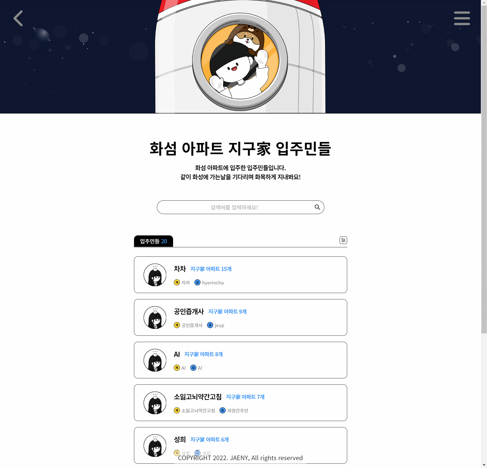
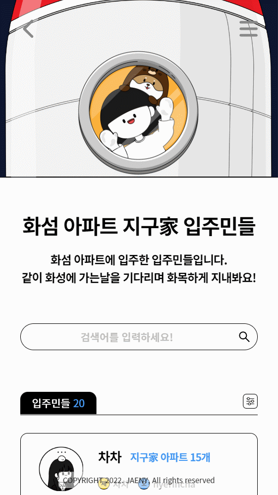
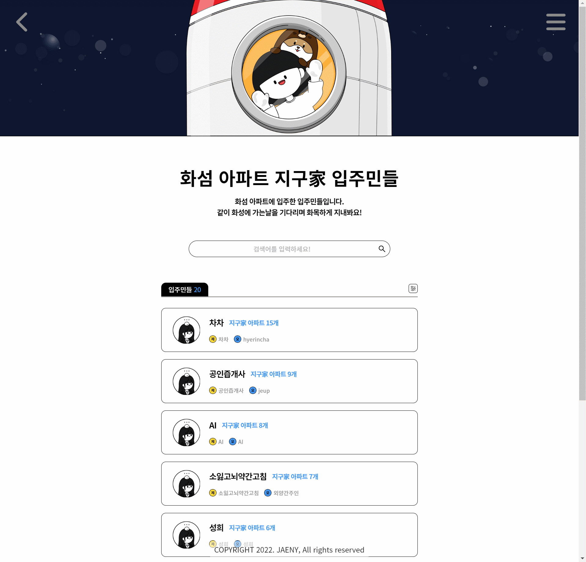

# 제조도 프론트엔드 코딩테스트

## 기술 스펙 (Tech Stacks)

    

## 구현 설명
`React`를 사용한 게시판 리스트 페이지

[디자인 시안보기](https://www.figma.com/file/q16bjp02UtvVDqK2rAHLym/%EC%A0%9C%EC%A1%B0%EB%8F%84-%ED%94%84%EB%A1%A0%ED%8A%B8-%EA%B0%9C%EB%B0%9C%EC%9E%90-%EC%BD%94%EB%94%A9%ED%85%8C%EC%8A%A4%ED%8A%B8?node-id=0%3A1)


### 로컬에서 실행하기

- client 코드 실행 전 server 코드를 받아주세요!
[json-server로 만든 API 코드 받기](https://github.com/JAENY007/JEJODO_Coding_TEST_server)

1. `npm i`로 패키지를 설치합니다
2. client 코드 실행 전 `json-server` 구동을 확인합니다
3. `json-server`가 정상적으로 구동중이라면
`npm start` 명령어를 통해 client 코드를 실행합니다

### 시연 영상

- [x] **`메인화면`**


<br/>


<br/>

- [X] **`검색화면`**


<br/>

<br/>

<br/>


<br/>

- [X] **`필터링화면`**


<br/>


---

### 패키지(라이브러리 등) 사용 근거

- **`antd (Ant Design)`**
    
    빠른 UI 생성을 위해 사용,
    
    Form의 name 속성 등을 사용하여 form의 데이터 송수신이 비교적 러닝커브가 낮음
    
- **`react-query`**
    
    query-key를 이용하여 간결한 API 통신코드 작성에 용이하다고 판단하여 사용
    
- **`axios`**
    
    기본 API 통신을 위해 적용
    
- **`react-router-dom`**
    
    SPA로 동작하는 웹페이지 생성을 위한 라우팅 기능을 이용하기 위해 사용
    
- **`styled-components`**
    
    CSS를 작성할때 전역으로 설정되는 것을 방지하고
    컴포넌트 별로 스타일을 적용하여 유지보수가 용이한 점
    
- **`prettier`**
    
    코드의 가독성을 보다 높이기 위해 사용

---

### 코딩 컨벤션 적용

**폴더 구조**

```md

- 폴더명은 모두 `camelCase`로 생성
- `pages` : 라우팅 처리가 되어있는 페이지 컴포넌트 폴더
- app내의 root폴더는 `root.{name}` / `app.{name}`
- 전역에서 사용할 모듈, CSS
// `root.modules` / `root.styled`
- app 의 공통 사용 폴더 입니다
// `app.feature` / `app.layout` / `app.components`
- 기능별로 폴더구조 분리
    - `screen/Screen~.tsx` : 하나의 기능에서 사용되는 화면 시작점
    - `component/` : 하나의 기능에서 사용되는 비즈니스 로직이 담긴 컴포넌트
    - `query/` : useQuery, useMutation 등 react-Query 모듈 함수
    - `app.feature/{feature}/` ~ `constant, store, module, hook` 필요 시 추가

```

**네이밍 컨벤션**

- 컴포넌트명 : `PascalCase` 적용
- 모듈함수, 상수 : `camelCase` 적용
- CSS 클래스 : `kebab-case` 적용

## 회고

**배운 점**

- GET요청만 사용했는데도,
생각보다 생각해야 할 부분들이 많았습니다

---

**고치고 싶은 점**

- 자잘한 버그가 생기는 것 같아서
해당하는 부분을 잘 고쳐보고 싶습니다

- 검색어 하이라이팅을 구현하지 못하여서
그 부분을 가능하다면 구현해보고 싶습니다

---

**공부해야 한다고 생각하는 것**

- TypeScript를 제대로 사용하지 못하는 부분이 있는데,
기본적인 JavaScript도 좀 더 깊게 공부 및 연구하고
각종 타입 및 제네릭 등에 대해서 더 공부해야 할 것 같습니다

- 또 아직 반응형 웹페이지 작성에 약간 무리가 있어
설계 단계에서 부터 꼼꼼히 체크하면서 개발을 해야 할 것 같습니다